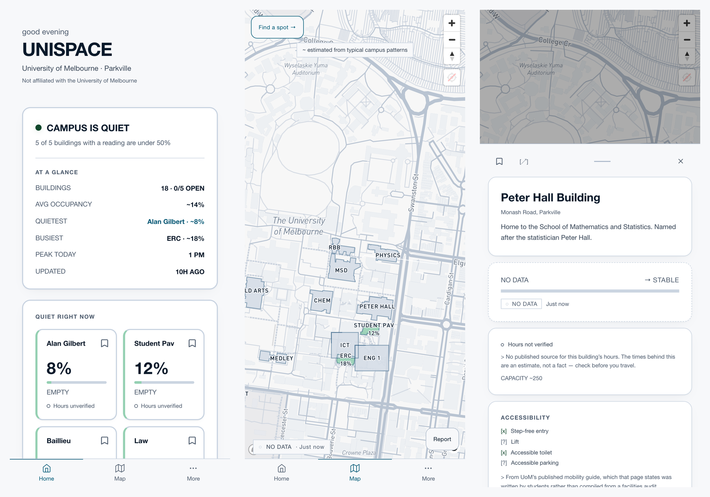
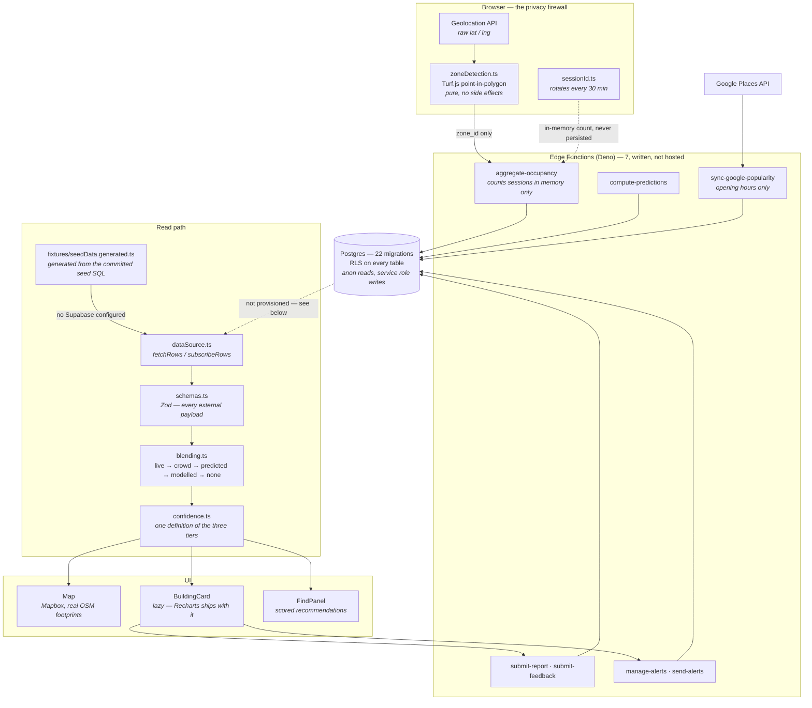

UniSpace shows how full every building on a university campus is, so students stop walking fifteen minutes to a library that turns out to be packed. No accounts, no sensors, and no GPS coordinate ever leaves the phone.

<p align="center">
  
</p>

<p align="center">
  <strong><a href="https://unispace-tawny.vercel.app">unispace-tawny.vercel.app</a></strong>
  &nbsp;·&nbsp;
  <code>pnpm install && pnpm dev</code> — runs fully, no backend, no API keys but a Mapbox token
</p>

| | |
|---|---|
| **Landing route** | **169 KB gzip**, down from 637 KB — Mapbox's 439 KB stays off it entirely |
| **Tests** | **388** across 33 files, including five that assert properties most projects only write down |
| **Campus data** | **18** buildings · **47** zones · **890** rooms · **1,156** modelled occupancy rows |
| **Coordinates sent to a server** | **None.** Zone matching runs on the device; a test fails the build if that changes |

[](https://github.com/br9704/UniSpace/actions/workflows/ci.yml)


[](https://unispace-tawny.vercel.app)

---

## What it does

During semester, finding a free desk means guessing. The cost of a wrong guess is not evenly
distributed: a commuter with ninety minutes between classes, or someone for whom each failed
attempt is ten minutes of physical effort, pays far more for it than someone who lives on campus.
UniSpace tries to answer the question before the walk instead of after it.

Buildings on the map are shaded by occupancy. Tapping one opens a floor-by-floor breakdown,
amenities, a room directory, a 24-hour prediction curve, and a "usually 38% at this time" line. A
filter panel ranks buildings by a score combining emptiness, walking distance and amenity match,
and a cross-building room search answers the question a first-year actually has — *which building
is Redmond Barry 101 in?* None of it requires an account, because requiring one would exclude
exactly the person who opens the app once a week on a train platform.

The real design problem is not showing occupancy. It is **showing occupancy honestly when you are
not sure** — which, for a crowdsourced app, is most of the time and all of the first week.
Occupancy is assembled from whichever source is best available, and the interface always says
which, in text as well as colour:

| | Source | | In the live demo |
|:--:|---|---|---|
| 1 | **Live crowdsourced** | People currently in the building | never — needs a backend |
| 2 | **Crowd reports** | Anonymous 1–5 reports, decaying over 30 min | only within your own session |
| 3 | **Predicted** | Model over the campus's own accumulated history | never — no history collected |
| 4 | **Typical estimate** | A modelled weekly curve, labelled as an estimate | **this is what you see** |
| 5 | **No data** | Grey polygon, stated plainly | outside a building's open hours |

Confidence is a visual state rather than a footnote. Estimates render at reduced intensity with a
dashed border and a `~` qualifier; only genuinely live data gets the status dot and the slow
breathing animation on the map. Cached readings are downgraded to `stale` rather than keeping the
source they arrived with, so they inherit the low-confidence treatment automatically. A test
enforces that an estimate can never render as a live reading.

That principle runs all the way down into the data. A building whose opening hours have no
published source reads "Hours not verified" with a hollow status dot instead of a confident OPEN
or CLOSED — and is deliberately *not* excluded by the "Open Now" filter, because filtering on
invented hours quietly cut the campus to five libraries on weekends. Accessibility flags are
nullable and render `[?]` when nobody has checked, with the provenance shown inline. Both are
visible in the third screenshot above.

The privacy design is the constraint everything else bends around. The browser reads GPS, matches
the point against building polygons locally with Turf.js, and sends a `zone_id` — never a
coordinate. Session identifiers rotate every thirty minutes, exist only in memory inside an Edge
Function, and are never written to a table. There is no analytics SDK of any kind. These are not
policies in a document; six of them fail the build if violated.

---

## Architecture



Two decisions shaped everything downstream.

**Zone matching happens on the client.** The moment a raw coordinate reaches a server, "we never
see where you are" becomes a claim about server-side behaviour that nobody outside the project can
check. So the point-in-polygon test was pushed into a pure function on the device and the wire
format reduced to a zone identifier — a promise a stranger can verify by opening the network tab.

**Every hook reads through one seam.** `dataSource.ts` exposes `fetchRows` / `subscribeRows`, and
nothing above it knows whether the rows came from Postgres or from a local fixture. It was
introduced to make the app runnable without a backend; the payoff turned out to be larger. The
fixtures are generated from the same committed seed SQL a real database would be seeded from, a
test fails if the two fall out of step, and the integration suite runs the whole read path — 18
buildings, blending, rendered values — with no network at all.

### There is no backend, and that is a decision

The demo reads from that committed fixture layer, not a database. **No Supabase project is
provisioned, and none will be** — hosted Postgres, Realtime and Edge Functions cost money every
month, and this is a portfolio project. The backend is deliberately parked, not pending.

That is a smaller gap than it sounds, because the backend was never the hand-waved part:

| Committed and reviewable | Running |
|---|---|
| 22 SQL migrations, applied in order, RLS on every table | — |
| 8 seed files: 18 buildings, 47 zones, 890 rooms, 1,156 occupancy rows | — |
| 7 Deno Edge Functions — aggregation, predictions, reports, alerts, feedback, hours sync | — |
| The React client and the 388-test suite that covers it | deployed |

The honest consequence, stated once: **the live-crowdsourced path has never run against real
users.** Its code is written and unit-tested, and the app is built to fall through to estimates
when it returns nothing — which, today, is always. What you can evaluate here is the client, the
data model, and how the interface behaves when it does not know something. What you cannot
evaluate is a production backend under load. Pointing `dataSource.ts` at a live project is an
environment-variable change, not a rewrite.

---

## How it was built

Most of this project's engineering time went into repairing itself. An audit was run against a
codebase whose plan recorded 199 completed tasks, treating every checkmark as a claim rather than
a fact. All three load-bearing claims were false. The Supabase project the app pointed at had been
**deleted** — three independent resolvers returned NXDOMAIN while `supabase.co` itself resolved
fine — taking with it a migration applied to the cloud but never committed. Tailwind was installed
at v4 while `index.css` used v3 syntax, so the theme scale never loaded and every utility drawing
a value from it silently emitted nothing; 53 non-Mapbox utilities existed in the entire shipped
bundle. And `pnpm build` had been failing for five sprints, because the audit step ran
`vite build`, which succeeds while `tsc -b` fails. Full findings: [`WIRING-AUDIT.md`](WIRING-AUDIT.md).

Six recovery sprints fixed roots rather than symptoms, and each left behind a test whose job is to
make that failure mode impossible rather than merely fixed. The CSS assertion compiles the real
stylesheet and checks the **build output**, because a source-level check would have passed happily
throughout the outage. Rebuilding the data layer as fixtures immediately surfaced a P0 that would
have shipped: `blendOccupancy` checked whether occupancy data was *fresh* but not whether it was
*real*, and since the aggregation function rewrites every row every ten seconds, a campus with
zero users would have reported every building as `Live · 0%` — confidently telling a student that
a full library was empty. All 23 existing blending tests passed throughout, because the test
helper defaulted to `data_quality: 'live'` and no test ever varied it.

That generator has been the most productive place to look for bugs, because everything downstream
inherits whatever it gets wrong. It was silently dropping every database-default timestamp column
behind an `as unknown as Building[]` cast, so `last_updated` was `undefined` campus-wide and every
freshness stamp in the deployed app failed its truthiness guard and rendered nothing. It was also
skipping migrations `010` and `011` entirely — both use a `WHERE id = '...'` form the seed parser
had no helper for — which meant no version of this database had ever held a real
footprint — a courtyard building like Old Arts was a flat four-cornered slab. Fifteen of eighteen
now carry their actual unsimplified OpenStreetMap way, 14 to 57 vertices each. The three that
could not be identified with confidence are still quadrilaterals and are named as such rather than
matched to a guess.

Measurement changed decisions repeatedly, and not always in the expected direction. Splitting
Mapbox out took the landing route from 637 KB to 169 KB gzip; the next optimisation, naming a
`charts` chunk for Recharts, made things **worse** — it was already correctly split behind the
lazy building card, and naming it caused the bundler to hoist it into a static import, adding
108 KB to the route in the name of shrinking it. Computing contrast ratios rather than eyeballing
them caught a regression introduced two sprints earlier: a text token measuring 2.56:1 was
carrying 49 pieces of real content. The same test later blocked a design revert — restoring the
university palette's literal gold (2.02:1) and green (2.42:1) failed 13 contrast assertions, so
the shipped values are hue- and saturation-preserved and darkened until they pass. One thing that
revert deliberately did *not* restore is the coloured occupancy percentage on each home tile: the
original green measures about 2.2:1 on the card, under the 3:1 floor for large text. The colour
lives on the stripe and the bar instead. Putting it back would have been a regression sold as a
revert.

The most interesting finding was not a bug but a schema limitation. Researching accessibility data
against the university's own sources showed that every flag in the database had been invented —
and, worse, that the columns could only say yes or no, so the true answer for most buildings,
*nobody has checked*, was unrepresentable. The columns are now nullable, a flag may never be set
`false` from an absence of evidence, and unverified flags render `[?]` with their provenance shown
inline. The same rule was then applied to opening hours. That is the third screenshot above: a
building the app knows things about, being explicit about the things it does not.

A related lesson, from the map. Building footprints were invisible against Mapbox's `light-v11`,
which draws roads near-white on a near-white ground because it is designed to sit *under* a
visualisation. The first fix matched layer ids like `road-motorway` and `road-primary` — the names
the full Streets style uses. `light-v11` collapses the entire road network into one `road-simple`
layer, so that pattern matched footpaths and steps and not a single street. It shipped looking
slightly better and was entirely wrong. Reading the ids out of the loaded style in a browser fixed
it in one attempt. Three separate bugs in this project have now had the same shape: the stylesheet
cannot be verified by reading it, only by measuring what a browser computes.

The clearest example of why that principle is worth the effort was also the last bug found. The
first line on the home screen announced **CAMPUS IS BUSY** while average occupancy read 14% and
every building on the list said EMPTY. The cause was a single fallback: `occupancy?.pct ?? 100`
scored a building with *no reading* as completely full, and 13 of 18 buildings have no reading, so
the app was declaring a crowded campus on the strength of missing data. It now judges quiet against
only the buildings that reported, and names its own denominator — "5 of 5 buildings with a reading
are under 50%". Absent data had been quietly rounded to bad news, in the one line a user reads
first, which is the failure this whole project is organised against.

The receipts are in [`MASTERPLAN.md`](MASTERPLAN.md) — the corrections, as-shipped deltas, and the
reasoning behind every deferral.

---

## Verification

`pnpm build` runs `tsc -b` before `vite build`, because the gap between those two is how three
fatal defects passed two separate audits. **388 tests across 33 files**, no DOM required —
component logic is extracted into pure functions and tested there.

Five assert properties rather than behaviour, which is the part worth stealing:

| File | Tests | What it makes impossible |
|---|---|---|
| [`src/lib/privacy.test.ts`](src/lib/privacy.test.ts) | 6 | Persisting a session id, writing one in an Edge Function `insert`/`upsert`/`update`, putting a coordinate in a request body, adding an analytics SDK, exposing the Google key to the client, or giving `zoneDetection` a side effect |
| [`src/lib/contrast.test.ts`](src/lib/contrast.test.ts) | 17 | Any text token dropping below WCAG AA — ratios computed from `index.css`, not inspected |
| [`src/lib/bundleBudget.test.ts`](src/lib/bundleBudget.test.ts) | 4 | The landing route exceeding budget, or Mapbox or Recharts reappearing on it. Measures the real `dist/` output |
| [`src/index.css.test.ts`](src/index.css.test.ts) | 14 | A framework config change silently emitting no CSS. Compiles the stylesheet through Vite and asserts against the build output |
| [`src/lib/dialogDismissal.test.ts`](src/lib/dialogDismissal.test.ts) | 8 | A `role="dialog"` reachable only by pointer. Finds every dialog in the tree and requires each to route through the one shared dismissal hook |

The last one is the clearest argument for writing tests this way. Two sheets were dismissible only
by backdrop tap or drag, and they cover the tab bar — so a keyboard user who opened a building card
was trapped behind it (WCAG 2.1.2). There *was* a test that pressed Escape, and it passed on the
bug, because it never asserted the sheet had actually gone. Replacing it with an invariant over
every dialog in the tree immediately surfaced a third one nobody had noticed. Asserting the
property rather than the instance is what turns a test from a record of what someone thought to
check into a constraint on the whole codebase.

Also enforced: no animation may ignore `prefers-reduced-motion`
([`motion.test.ts`](src/lib/motion.test.ts)); an estimate may never render as a live reading
([`confidence.test.ts`](src/lib/confidence.test.ts)); no building may carry occupancy curves for a
day it is closed ([`seedData.test.ts`](src/lib/fixtures/seedData.test.ts)); no clickable `div` may
reappear where a `<button>` belongs ([`a11y.test.ts`](src/lib/a11y.test.ts)); and every external
payload is parsed through a Zod schema ([`schemas.test.ts`](src/lib/schemas.test.ts)).

---

## Usage

```bash
git clone https://github.com/br9704/UniSpace.git
cd UniSpace
pnpm install

cp .env.example .env.local
# Add VITE_MAPBOX_TOKEN. Leave the Supabase vars blank — fixtures switch on
# automatically, which is what a real deployment looks like before it has users.

pnpm test
pnpm dev
```

```
$ pnpm test

 Test Files  33 passed (33)
      Tests  388 passed (388)
```

You get all 18 buildings, their floor zones, the room directory and the weekly occupancy curves,
with no live occupancy — the cold-start state, which is the one the interface most needs to handle
well.

| Command | |
|---|---|
| `pnpm dev` | Dev server on fixtures |
| `pnpm build` | `tsc -b && vite build` — never `vite build` alone |
| `pnpm test` | 388 unit and integration tests |
| `pnpm lint` | ESLint, zero suppressions in the codebase |
| `pnpm generate:fixtures` | Regenerate fixtures after editing `supabase/seed/` |

| Variable | Where | |
|---|---|---|
| `VITE_MAPBOX_TOKEN` | `.env.local` | Map tiles. The only one needed to run locally |
| `VITE_SUPABASE_URL` · `VITE_SUPABASE_ANON_KEY` | `.env.local` | Omit to run on fixtures |
| `VITE_USE_FIXTURES` | `.env.local` | Force fixtures on or off; omit to auto-detect |
| `VITE_VAPID_PUBLIC_KEY` | `.env.local` | Web Push subscription |
| `GOOGLE_PLACES_API_KEY` · `VAPID_*` · `IP_HASH_SALT` | Supabase secrets | Server-side only, never `VITE_`-prefixed |

---

## Pilot campus

University of Melbourne, Parkville — 18 buildings, 47 floor zones, 890 rooms.

Fifteen of the 18 carry their real OpenStreetMap footprint, 14 to 57 vertices each. The other
three — Engineering Building 1, the ICT Building and Kwong Lee Dow — could not be identified in
OSM with confidence and are left as rectangular approximations rather than matched to a guess.
Buildings are matched to OSM **by name, never by proximity**, because several seeded coordinates
were wrong and proximity matching inherits that error instead of exposing it: Melbourne School of
Design was seeded 428 m from the Glyn Davis Building it actually occupies.

> Building geometry © [OpenStreetMap](https://www.openstreetmap.org/copyright) contributors,
> available under the [Open Database License](https://opendatacommons.org/licenses/odbl/) (ODbL).
> The ODbL governs that geometry and applies independently of this repository's own licence.

Capacity figures are directional and marked `~`. The weekly occupancy curves are UniSpace's own
modelled estimates of campus rhythm — not measurements, and not Google data.

---

## Limitations

**Occupancy is modelled, not measured.** The weekly curves are hand-authored estimates. No reading
in the live demo has ever come from a person.

**Google does not provide busyness data.** The Places API exposes no live or typical popularity —
the Popular Times shown in Google Maps is an internal feature with no public endpoint. Google is
used here for opening hours and nothing else. An earlier version of this app claimed otherwise in
four places; that was wrong and was removed.

**Accessibility data is partial, and the app says so per building.** From the University's own
campus map: 16 of 18 buildings have a mapped lift, 17 have a mapped accessible toilet, exactly
**one** has entrances the map explicitly labels accessible, and **no source exists at all** for
accessible parking — the map has no such category, so all 18 are `NULL`. Nothing is ever recorded
as `false` from an absence of evidence. Do not rely on this for access planning; confirm with the
University.

**Opening hours are sourced for 5 of 18 buildings.** The other 13 carry invented seed values and
are labelled as unverified. Sourced hours come from a current-week table and will be wrong over
exams and holidays.

**The room directory is incomplete.** 890 rooms across 17 of 18 buildings, with code, name, floor
and type. Capacity, power and bookability are `NULL` because the source publishes none of them.
One building has no rooms: its seeded name does not match anything the University publishes, and
guessing which building it is would be exactly the failure this project spent six sprints
correcting.

**Not verified here:** Lighthouse scores, throttled-3G behaviour, VoiceOver, PWA install on real
iOS and Android hardware, and two motion claims that need a screen recorder.

**Deliberately out of scope:** friend presence, personalised recommendations and the analytics
dashboard would all require user accounts, which contradicts the thing this app is for.

---

## Status

Live and feature-complete. Every engineering task through Sprint 25 is closed, the recovery phase
is shut, and the deployed build passes CI. The backend stays committed-but-unhosted by choice, and
what remains genuinely outstanding is real-world data the repository cannot produce: accessible
parking for any building, step-free entry for 17, hours for 13, and CC-licensed building
photographs. Each is listed in [`MASTERPLAN.md`](MASTERPLAN.md) rather than quietly rounded up.

One note on history: Sprint R3 applied a dark, single-accent design system called SIGNAL, with a
monospace "instrument voice" throughout. Its component decomposition and accessibility work stand
and are load-bearing, but **the visual layer was reverted on 2026-08-15** — university navy and
azure on a light ground, the monospace dropped across 113 elements, and the terminal affordances
(`</section>` labels, `~/home`, bracketed controls) replaced with words and icons. The reasoning
is in the masterplan's Architecture Decisions Log. The screenshots above are the current build.

| | |
|---|---|
| Product requirements | [`PRD.md`](PRD.md) |
| Sprint plan, decisions, deferrals | [`MASTERPLAN.md`](MASTERPLAN.md) |
| The audit that started the recovery | [`WIRING-AUDIT.md`](WIRING-AUDIT.md) |
| Portfolio card, machine-readable | [`PROJECT.json`](PROJECT.json) |

## License

All rights reserved. Copyright © 2026 Bruno Jaamaa. See [`LICENSE`](LICENSE).

## Author

Bruno Jaamaa — [brunojaamaa.dev](https://brunojaamaa.dev) · [@br9704](https://github.com/br9704)

Not affiliated with, endorsed by, or connected to the University of Melbourne.
